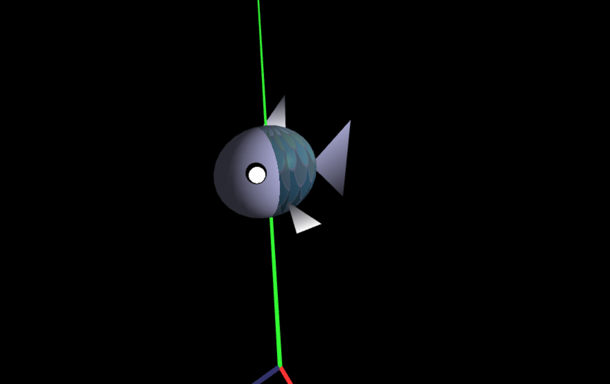
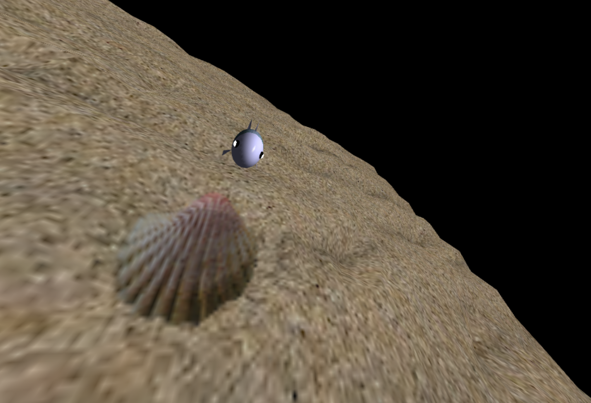

# CGRA 2020/2021

## Group T03G03

João Andrade (up201905589);  Sérgio Estêvão (up201905680)

## Project Notes

Although we changed a few things to our liking, we fulfilled all of the objectives that were proposed on this project.
When it comes to the additional functionalities on point **7** we chose:
- 7.1 Seaweed
- 7.2 Moving Seaweed
- 7.6 Upgraded fish shader

## Screenshots

### 1 - MyFish

*Image a - Fish appearance and details*

*Image b - Fish appearance and details*

### 2 - Sea Floor

*Image a - Sea floor and Nest details*

*Image b - Sea floor and Nest details*

### 3 - Water Surface

*Image a - Water Surface details*

*Image b - Water Surface details*

### 4 - Rocks

*Image a - Individual Rock*

*Image b - Group of rocks in the sand*

### 5 - Pillars

*Image a - Pillar details*

*Image b - Pillar details*

### 6 - Global view

*Image - Global view of the scene*

### 7 - Fish Carrying Rock and Nest with rocks

*Image a - Fish Carrying Rock*

*Image b - Nest with rocks*

### 8 - Sea Weed moving and Upgraded  Fish Shader

*Image a - Sea weed in motion*

*Image a - Sea weed in motion*

*Image b - Fish's shader upgraded*

*Image b - Fish's shader upgraded*